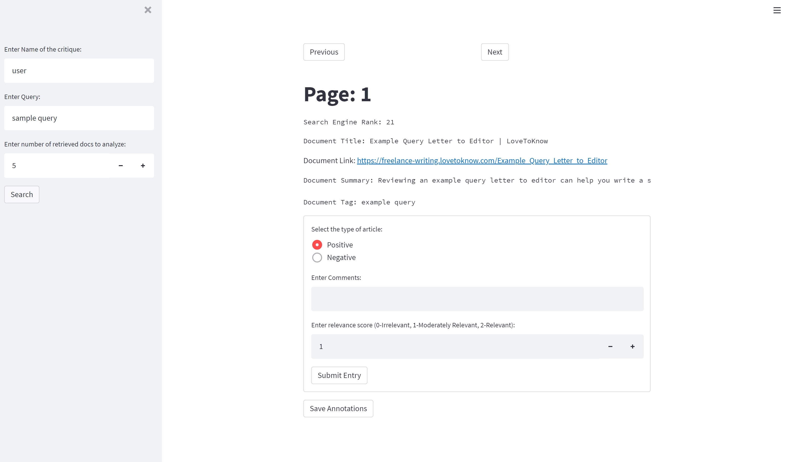

## To run: _streamlit run streamlit_interface.py_ in the terminal

# Interface Sample

# Output
- results.csv -> Annotated data from multiple users
- temp_search_results.csv -> temporary cache of retrieved documents